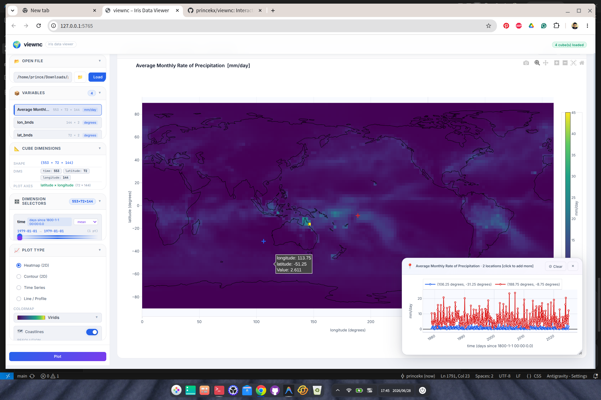

# viewnc

**Interactive iris data viewer** for NetCDF, PP and GRIB files — powered by Python `iris` and `Plotly.js`.



*Average Monthly Rate of Precipitation (mm/day) plotted as an interactive heatmap with Natural Earth coastlines overlaid.*

---

## Quick Start

```bash
# Install (once)
pip install -e /path/to/viewnc

# Open a file directly — browser opens automatically
viewnc /path/to/data.nc

# Or start the server and use the built-in file browser
viewnc --port 5765
```

Browser opens at **http://127.0.0.1:5765** automatically.

---

## Features

### Core viewer

| Feature | Details |
|---|---|
| **File formats** | NetCDF4, PP, GRIB2 (via `iris`) |
| **File browser** | Server-side filesystem browser with breadcrumb navigation, file size & date metadata, type-to-filter |
| **Variable browser** | Lists all cubes with shape, units and coordinate summary; click any card for a full coordinate & attribute modal |
| **2D Heatmap** | Interactive Plotly heatmap with hover, zoom and pan |
| **2D Contour** | Filled contour with contour labels |
| **Time Series** | Spatial-mean time series collapsed over lat/lon |
| **Line / Profile** | Cross-section line plot through the middle row |
| **Colormaps** | RdBu_r, Viridis, Plasma, Inferno, YlOrRd, Blues, Greens, Greys, Hot, Jet |
| **Coastlines** | Natural Earth overlay at 110 m / 50 m / 10 m resolution; selectable line colour |
| **Aspect ratio** | Lat/lon plots automatically lock to 1°lat = 1°lon (equirectangular) |
| **Statistics bar** | Live min / max / mean / std updated after every plot |

### Dimension sliders

Each non-spatial dimension (time, pressure level, ensemble member, …) gets a **dual range slider** with a **Start** and **End** handle:

- Dragging **Start** snaps End to the same position → single time step / level selected by default.
- Dragging **End** independently widens the selection to a range.
- The **aggregation processor** (mean, min, max, sum, …) collapses the selected range before plotting.

### Multi-axis location series (click-to-plot)

Click anywhere on a 2-D heatmap or contour plot to open the **Axis Picker** and choose which dimension to plot along:

| Axis choice | What is plotted |
|---|---|
| 🕒 **time** | Time series at the clicked (lon, lat) point |
| 🌡️ **pressure / level** | Vertical profile at the clicked point (portrait window, Y-axis inverted so surface is at the bottom) |
| 🎲 **ensemble** | Series over ensemble members at the clicked point |
| ↕️ **latitude** | Meridional profile — values at all latitudes along the clicked longitude (current time/level slice) |
| ↔️ **longitude** | Zonal profile — values at all longitudes along the clicked latitude (current time/level slice) |

Each axis opens its own **independent floating window** that is draggable and resizable:

- Multiple clicks on the **same axis** add traces to the same window for comparison.
- Clicks on **different axes** open separate, side-by-side windows.
- **Vertical profile** windows open in portrait orientation (340 × 520 px); all others open in landscape (520 × 320 px).

### Per-window export

Every series window has three download buttons:

| Button | Format | Notes |
|---|---|---|
| ⬇ **CSV** | Comma-separated | One column per clicked location |
| ⬇ **PNG** | High-res PNG | 2× scale; portrait or landscape to match the window |
| ⬇ **NC** | NetCDF4 | CF-1.8 compliant; one variable per location; time axes stored as index + ISO label attribute |

---

## Usage

1. Launch `viewnc` — the browser opens automatically.
2. Click **📁** to browse the filesystem, or paste a file path and press **Load**.
3. Click a variable in the **Variables** list to select it.
4. Use the **Dimension Sliders** to pick a time step or level:
   - Drag **Start** to move to a new position (End follows automatically → single point).
   - Drag **End** rightward to select a range, then choose an aggregation method.
5. Choose a **Plot Type** and **Colormap**, then click **Plot**.
6. Toggle **Coastlines** on/off; select resolution and line colour.
7. **Click on the plot** to open the Axis Picker and plot a location series.
8. Use the floating window controls to export, clear or close the series.

---

## API Endpoints

| Route | Method | Purpose |
|---|---|---|
| `/api/load` | POST | Load a file; returns cube metadata |
| `/api/slice` | POST | Extract a 2-D slice respecting constraints |
| `/api/location_series` | POST | Extract a 1-D series along any axis at a clicked point |
| `/api/coastlines` | GET | Retrieve Natural Earth coastline geometry |
| `/api/browse` | GET | Server-side filesystem listing |
| `/api/export/csv` | POST | Export the current 2-D slice as CSV |
| `/api/export/netcdf` | POST | Export the current 2-D slice as NetCDF |
| `/api/export/series_csv` | POST | Export one axis-window's series as CSV |
| `/api/export/series_netcdf` | POST | Export one axis-window's series as NetCDF |

---

## Dependencies

| Package | Purpose |
|---|---|
| `iris >= 3` | Climate data loading and slicing |
| `flask >= 3` | Lightweight web server |
| `numpy` | Array operations |
| `cartopy` | Natural Earth coastline geometries |
| `matplotlib` | Iris back-end (required by iris) |
| `netCDF4` *(optional)* | NetCDF4 series export (falls back to `scipy` if absent) |

Frontend: **Plotly.js 2.35** (CDN), **Google Fonts** (Inter, JetBrains Mono).

---

## Project Structure

```
viewnc/
├── viewnc/
│   ├── app.py          # Flask routes: load, slice, location_series, export …
│   ├── iris_loader.py  # Iris loading, slice extraction, coordinate resolution
│   ├── cli.py          # viewnc command-line entry point
│   ├── static/
│   │   ├── app.js      # Frontend logic: Plotly, axis picker, series windows, export
│   │   └── style.css   # Dark glassmorphism design system with dual-slider & series UI
│   └── templates/
│       └── index.html  # Single-page application shell
├── docs/
│   └── screenshot.png  # UI screenshot
├── setup.py
└── README.md
```

---

## Installation (development)

```bash
git clone git@github.com:princekx/viewnc.git
cd viewnc
pip install -e .
```
