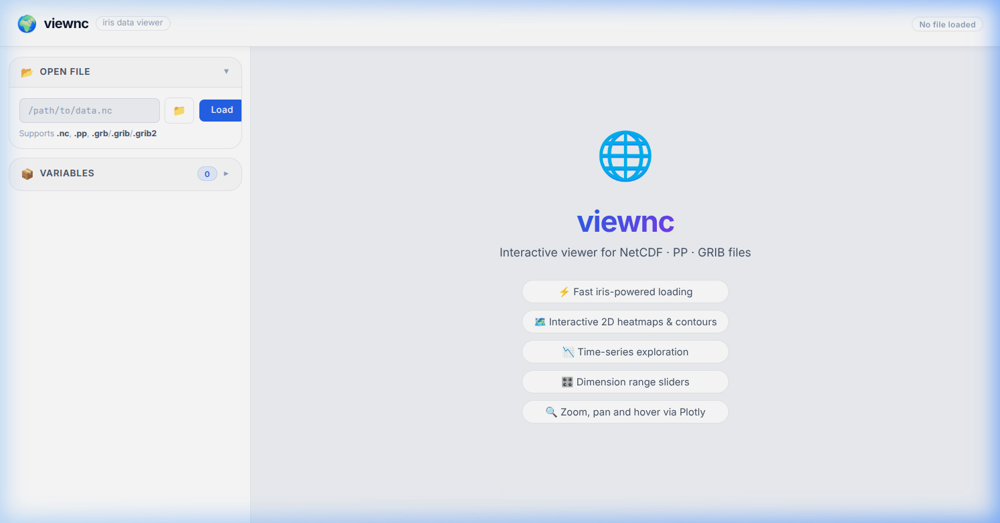
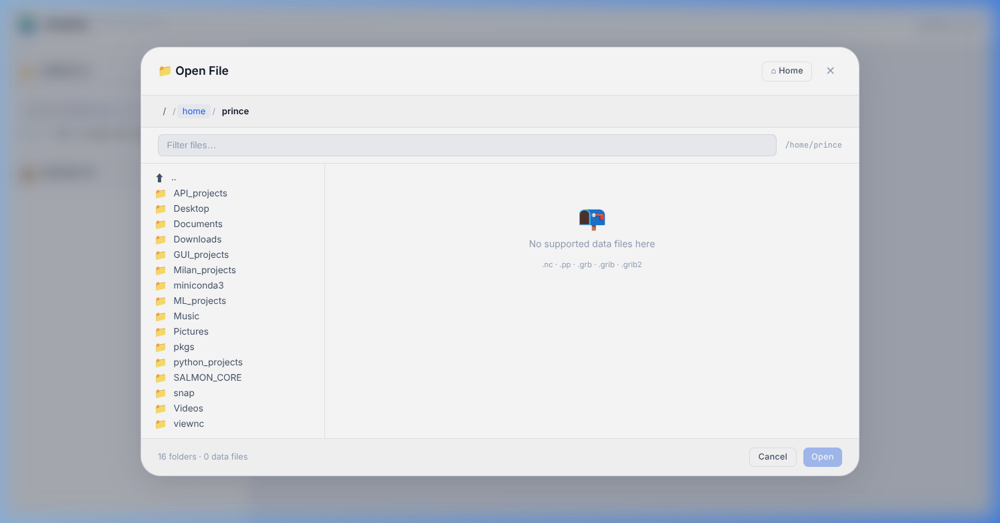
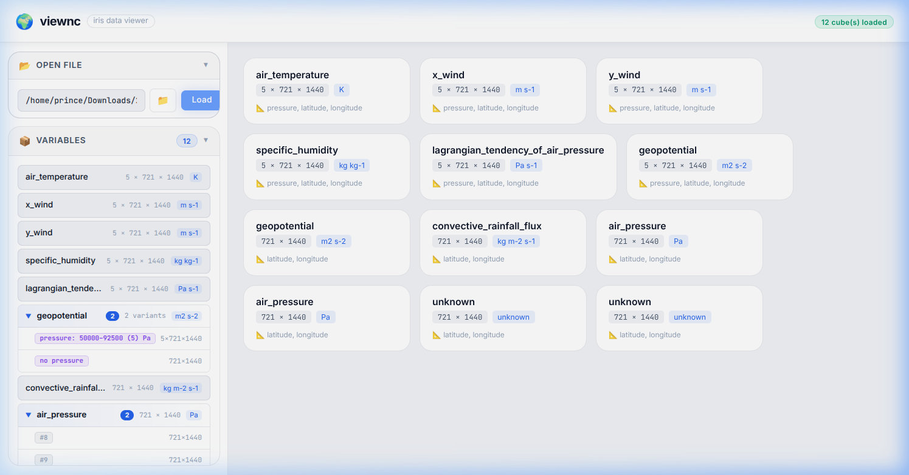
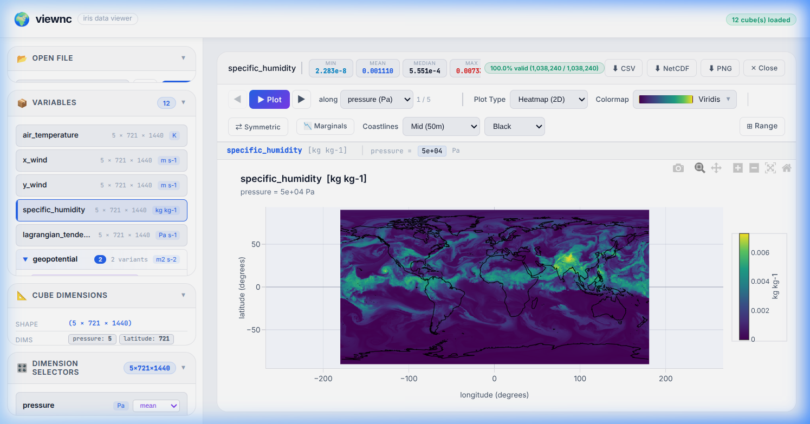

# viewnc

**Interactive climate data viewer** for NetCDF, PP, GRIB and GRIB2 files —  
powered by Python `iris` and `Plotly.js`.



---

## Quick Start

```bash
# Install (once)
pip install -e /path/to/viewnc

# GRIB/GRIB2 support — install extra dependencies
pip install iris-grib eccodes

# Open a file directly — browser opens automatically
viewnc /path/to/data.nc
viewnc /path/to/forecast.grib2

# Or start the server and use the built-in file browser
viewnc --port 5765
```

Browser opens at **http://127.0.0.1:5765** automatically.

---

## Screenshots

### Welcome screen & file browser



Click **📁** to browse the filesystem with breadcrumb navigation, or paste  
a path directly into the input and press **Load**.

### GRIB2 file loaded — grouped variable list



When a GRIB2 file contains the same variable at multiple pressure levels,  
viewnc automatically **merges them into a single 3-D cube** (level × lat × lon)  
and shows it as one entry in the Variables panel.

### Interactive heatmap with coastlines



Select a variable, move the pressure-level slider to the desired level,  
choose a colormap and click **Plot**. Natural Earth coastlines overlay  
automatically for geographic data.

---

## Features

### Core viewer

| Feature | Details |
|---|---|
| **File formats** | NetCDF4, PP, GRIB (Edition 1), GRIB2 (Edition 2) |
| **File browser** | Server-side filesystem browser with breadcrumb navigation, file-size & date metadata |
| **Variable browser** | Grouped by name; click a card for a full coordinate & attribute modal |
| **2-D Heatmap** | Interactive Plotly heatmap with hover, zoom and pan |
| **2-D Contour** | Filled contour with contour labels, configurable levels |
| **Line / Profile** | 1-D line plot for low-dimensional data |
| **Colormaps** | 60+ palettes across 6 groups (perceptual, diverging, sequential, oceanographic, qualitative) |
| **Coastlines** | Natural Earth overlay at 110 m / 50 m / 10 m; selectable line colour |
| **Statistics bar** | Live min / max / mean / std updated after every plot |
| **Frame navigation** | ◀ ▶ buttons step through any extra dimension one frame at a time |

### GRIB / GRIB2 support

viewnc includes a comprehensive **resilience patch suite** applied at load time  
to handle the many real-world GRIB2 quirks that `iris_grib` rejects by default:

| Patch | Problem fixed |
|---|---|
| `_get_surface_value` | Missing Second Fixed Surface (`typeOfSecondFixedSurface = 255`) — returns `None` instead of raising |
| `reference_time_coord` | Unknown `significanceOfReferenceTime` codes — reconstructs a fallback `forecast_reference_time` coord |
| `scanning_mode` | Unsupported alternative-row scanning bit — cleared and retried |
| `source_of_grid_definition` | Non-zero (pre-defined operational grid) — logged and ignored |
| `grid_definition_section` | Any remaining unsupported grid type — caught per-message so only that message is skipped |

**Three-layer load strategy:**

1. **Fast path** — `iris.load()` with all patches applied (covers most files).
2. **Per-message fallback** — iterates `iris_grib.load_cubes()` as a generator, skipping bad messages and logging a summary (`3×TranslationError, 1×KeyError`).
3. **Last resort** — returns an empty `CubeList` with a clear error log rather than crashing.

**Automatic level merging:**

GRIB2 files typically expose one cube per pressure level. viewnc  
automatically calls `iris.cube.CubeList.merge()` after loading, which  
promotes scalar `pressure` (or `air_pressure`, `model_level`, …) aux-coords  
into a proper dimension. 17 single-level `specific_humidity` cubes become  
**one** cube of shape `(17, lat, lon)` with a `pressure` dim-coord and a  
level slider.

**Longitude normalisation:**

GRIB/GRIB2 files store longitude as 0–360°. viewnc detects this and  
rolls the data columns so longitudes are monotonically increasing in the  
−180 to +180 range, ensuring the heatmap and coastline overlay align correctly.

### Dimension sliders

Each non-spatial dimension (time, pressure level, ensemble member, …) gets a  
**dual range slider** with **Start** and **End** handles:

- Dragging **Start** snaps End to the same position → single time step / level.
- Dragging **End** widens the selection to a range.
- The **aggregation processor** (mean, min, max, sum, std, …) collapses the range before plotting.

### Grouped variable list

Variables that share the same name are shown under a **collapsible group header**.  
Each member displays only the metadata that makes it unique:

- Scalar pressure / height / model-level value from `aux_coords` (primary — GRIB2)
- Differing dim-coord ranges (secondary — NetCDF with multiple realisations)
- Units or shape (fallback)

Example: a GRIB2 ensemble file might show:

```
▶ specific_humidity  [17]  17 × 181 × 360  kg kg-1
    pressure: 100000 Pa    17×181×360
    pressure: 85000 Pa     17×181×360
    …
```

### Multi-axis location series (click-to-plot)

Click anywhere on a 2-D heatmap or contour to open the **Axis Picker**  
and choose which dimension to plot along:

| Axis | What is plotted |
|---|---|
| 🕒 **time** | Time series at the clicked (lon, lat) point |
| 🌡️ **pressure / level** | Vertical profile (Y-axis inverted so surface is at the bottom) |
| 🎲 **ensemble** | Series over ensemble members |
| ↕️ **latitude** | Meridional profile along the clicked longitude |
| ↔️ **longitude** | Zonal profile along the clicked latitude |

Each axis opens its own independent **floating window** (draggable, resizable).  
Multiple clicks on the same axis **add traces** for comparison.

### Per-window export

| Button | Format | Notes |
|---|---|---|
| ⬇ **CSV** | Comma-separated | One column per clicked location |
| ⬇ **PNG** | High-res PNG | 2× scale |
| ⬇ **NC** | NetCDF4 | CF-1.8 compliant; one variable per location |

---

## Usage

1. Launch `viewnc` — the browser opens automatically.
2. Click **📁** to browse the filesystem, or paste a file path and press **Load**.
3. Click a variable in the **Variables** panel to select it.
4. Use the **Dimension Sliders** to pick a time step or pressure level.
5. Choose a **Plot Type** and **Colormap**, then click **Plot**.
6. Toggle **Coastlines** on/off; select resolution and line colour.
7. **Click on the plot** to open the Axis Picker and plot a location series.
8. Use the **◀ ▶** frame buttons to step through the chosen dimension.

---

## API Endpoints

| Route | Method | Purpose |
|---|---|---|
| `/api/load` | POST | Load a file; returns cube metadata |
| `/api/slice` | POST | Extract a 2-D slice respecting constraints |
| `/api/location_series` | POST | Extract a 1-D series along any axis |
| `/api/coastlines` | GET | Natural Earth coastline geometry |
| `/api/browse` | GET | Server-side filesystem listing |
| `/api/stats` | POST | Descriptive statistics for the current slice |
| `/api/export/csv` | POST | Export the current 2-D slice as CSV |
| `/api/export/netcdf` | POST | Export the current 2-D slice as NetCDF |
| `/api/export/series_csv` | POST | Export a series window as CSV |
| `/api/export/series_netcdf` | POST | Export a series window as NetCDF |

---

## Dependencies

| Package | Purpose |
|---|---|
| `iris >= 3` | Climate data loading and slicing |
| `flask >= 3` | Lightweight web server |
| `numpy` | Array operations |
| `cartopy` | Natural Earth coastline geometries |
| `matplotlib` | Iris back-end (required by iris) |
| `iris-grib` *(optional)* | GRIB / GRIB2 format support |
| `eccodes` *(optional)* | ECMWF GRIB codec (required by iris-grib) |
| `netCDF4` *(optional)* | NetCDF4 series export (falls back to `scipy`) |

Frontend: **Plotly.js 2.35** (CDN), **Google Fonts** (Inter, JetBrains Mono).

---

## Project Structure

```
viewnc/
├── viewnc/
│   ├── app.py          # Flask routes: load, slice, location_series, export …
│   ├── iris_loader.py  # Loading, GRIB2 patches, merge, slice extraction
│   ├── cli.py          # viewnc command-line entry point
│   ├── static/
│   │   ├── app.js      # Frontend: Plotly, grouped var list, axis picker, export
│   │   └── style.css   # Design system: panels, sliders, var-group, diff-tags
│   └── templates/
│       └── index.html  # Single-page application shell
├── docs/
│   ├── screenshot_welcome.png
│   ├── screenshot_browser.png
│   ├── screenshot_grib2_loaded.png
│   └── screenshot_grib2_plot.png
├── setup.py
└── README.md
```

---

## Installation (development)

```bash
git clone git@github.com:princekx/viewnc.git
cd viewnc
pip install -e .

# Optional: GRIB/GRIB2 support
pip install iris-grib eccodes
```
